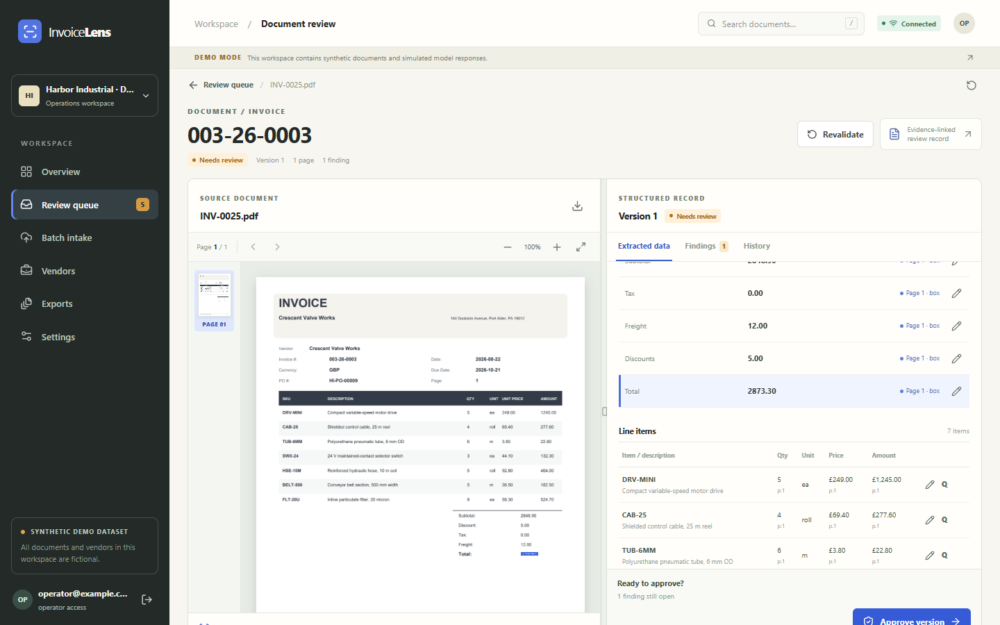

# InvoiceLens

> An evidence-first invoice review workbench.



[Getting started](#getting-started) · [Architecture](docs/ARCHITECTURE.md) · [Evaluation](docs/EVALUATION.md) · [Security](docs/SECURITY.md)

## Overview

InvoiceLens is a document review workbench for **Harbor Industrial**, a fictional equipment distributor. Operators upload invoices and purchase orders, inspect source evidence beside extracted values, resolve arithmetic and matching exceptions, approve a specific version, and download an accounting-ready CSV, XLSX, or JSON export.

This is an independent portfolio project and a self-hostable commercial pilot starting point. The local dataset is explicitly **Synthetic demo dataset**. It contains no real customer documents, transactions, or claimed savings. See [implementation status](docs/IMPLEMENTATION_STATUS.md) for verified checks and current limits.

### Core workflow

**Upload → extraction → source review → exception resolution → version approval → export**

### Capabilities

- Page-level evidence beside extracted values
- Invoice and purchase-order matching with version-bound decisions
- Accounting-ready CSV, XLSX and JSON exports

### Technology

FastAPI · React · LangGraph · PostgreSQL · OCR

### Evidence and scope

55 integration tests passed; 300/300 synthetic documents processed in the final offline run. Finding precision remains below the release target; details are in the evaluation report. The included demo uses synthetic data and local simulators. Deployment and live-provider limits are documented in [implementation status](docs/IMPLEMENTATION_STATUS.md).

## Getting started

Run the local demonstration from the repository root using the project-specific instructions below. External service credentials are needed only for connected integrations.

### Run the local DEMO

Prerequisites: Python 3.12, [uv](https://docs.astral.sh/uv/), Node.js 24, pnpm 11, and Poppler `pdftoppm` for synthetic scanned-PDF generation. Tesseract OCR with the `eng` model is needed to extract scanned pages locally; without it, scans are routed to an actionable review/error state. The Windows launcher also recognizes a private copy at `tmp/tesseract-ocr/tesseract.exe` when `tmp/tesseract-ocr/tessdata/eng.traineddata` exists, and limits OCR to one thread. Keep ports 8790 and 5789 free.

Windows PowerShell:

```powershell
pwsh -File scripts/demo.ps1 -Size fast
```

macOS/Linux:

```bash
cd /path/to/invoicelens
bash scripts/demo.sh fast
```

The command installs locked dependencies, generates the fast synthetic fixture if absent, migrates the local database, seeds four purchase orders, and starts the API and web client. Five invoice PDFs remain in `generated/invoicelens-fast/documents` for a fresh batch upload. Open [the workbench](http://127.0.0.1:5789). Use `-PrepareOnly` / `--prepare-only` to install and seed without starting servers. For the full 300-document acceptance fixture, use `-Size full` / `full`; it can take longer. `-Reset` / `--reset` intentionally replaces only DEMO workspaces. Existing local records are otherwise preserved.

If Python is not discoverable by `uv`, set `INVOICELENS_PYTHON` to an installed Python 3.12 executable before running the script. The scripts place uv's cache and managed-Python directory inside this project to avoid profile permissions issues.

Demo users (all use `DemoPass123!`):

| Email | Role | Workspace |
|---|---|---|
| `admin@example.com` | admin | harbor-demo-a |
| `operator@example.com` | operator | harbor-demo-a |
| `viewer@example.com` | viewer | harbor-demo-a |
| `operator2@example.com` | operator | harbor-demo-b |

These accounts exist only after DEMO seeding. Never use them for customer data.

## Connected installation

Copy `.env.example` to `.env` and set unique `POSTGRES_PASSWORD` and `INVOICELENS_SECRET_KEY` (at least 32 characters), a configured `INVOICELENS_OPENAI_MODEL`, and `INVOICELENS_OPENAI_API_KEY` with a spending limit. Then start `docker compose up --build -d`. The Compose stack uses PostgreSQL, persistent volumes, and a production-built static web client. It does **not** seed fictional users or documents in CONNECTED mode. Complete customer bootstrap and HTTPS configuration as described in [OPERATIONS.md](docs/OPERATIONS.md). The live model path never silently falls back to a simulated result after an error. A live smoke test remains pending until credentials and a spending limit are supplied.

## Repository guide

| Path | Purpose |
|---|---|
| `apps/api` | FastAPI, persistence, extraction, validation, review, approval and export |
| `apps/web` | React workbench and source-evidence viewer |
| `scripts` | Deterministic data generation and DEMO launch |
| `generated` | Reproducible bulk source files, ignored by Git |
| `evals` | Separate ground truth and evaluation runner/results |
| `docs` | Product, architecture, API, operations, security, evaluation, and handover |

The [product scope](docs/PRODUCT.md), [architecture](docs/ARCHITECTURE.md), [data card](docs/DATA_CARD.md), [evaluation](docs/EVALUATION.md), [portfolio case study](docs/PORTFOLIO.md), [commercialization guide](docs/COMMERCIALIZATION.md), and [handover](docs/HANDOVER.md) give the intended use and the evidence for what works today.

