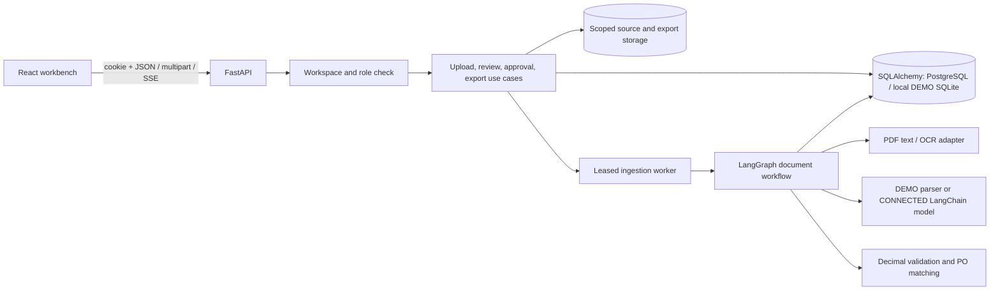
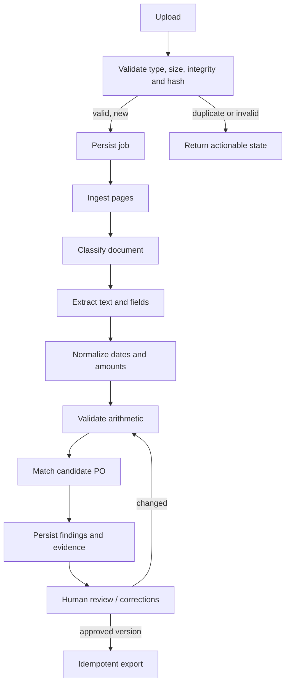
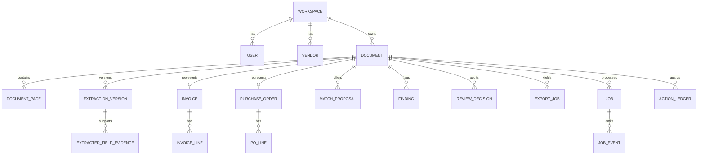

# Architecture

InvoiceLens is a modular monolith with a React client, FastAPI service, durable relational records, scoped source-file storage, and a background ingestion worker. Business calculations and approval rules run on the server. The client caches server state but does not decide totals or approval eligibility.

The installation path uses PostgreSQL. Local DEMO uses SQLite to remove a prerequisite for a complete local journey. PostgreSQL checkpoint compilation and an isolated database dump/restore were smoke-tested; a paired source-storage restore and customer deployment checks remain necessary.

## Workflow and recovery

The job row is the durable work schedule, with progress, attempts, lease, cancellation and failure state. Graph checkpoints preserve workflow state, but do not themselves pick up abandoned jobs after a process crash. Recovered workers reclaim expired leases. A graph thread/run ID is never sufficient authorization; each API entry point checks the workspace and role before reading or resuming work.

## Data model

Every business record carries a workspace key. File and export paths are derived from server IDs within a workspace root. Extraction versions retain normalized values and a content hash; field evidence retains raw source text, page number and, only when measured from the page, a span or bounding box. PO and line choices are stored in a new extraction version and audited in `ReviewDecision`; no separate match-resolution table is needed. Approval checks the current hash, unresolved match blockers, and cumulative approved quantities against the selected PO line. Concurrent approvals serialize on that PO row; a PO correction revalidates dependent invoices and revokes their old approvals. Export checks approval again.

## Boundaries

- The parser/OCR and model adapters receive bounded document text or pages and return validated typed data. PDF and image pages are checked against a raster-size limit before rendering. Documents are untrusted input, not instructions for the application.
- CONNECTED extraction plans source pages into batches of at most five, with at most 20 calls and a 200,000-character document text budget. It never truncates pages silently: oversized inputs and missing/conflicting per-page responses yield actionable job errors. Each model fact must declare one requested source page; evidence lookup stays on that page, while unverified text coordinates remain empty. The live provider response quality has not been measured without credentials and a spending cap.
- The matching engine prioritizes exact PO IDs from the same vendor. Fuzzy proposals are bounded by workspace/vendor and structured numeric suffix; a neighboring PO number is not treated as a match. Alias vendor names with several known full-name candidates are flagged for correction. Ambiguous PO and many-to-one line candidates require explicit operator choices; accepting the finding alone does not clear the approval blocker.
- Decimal and currency rounding rules calculate totals. Confident invoice/PO price and quantity discrepancies require complete, self-consistent source rows; an unreadable PO row blocks approval for source review. The model never supplies authoritative arithmetic.
- Export adapters share a versioned accounting schema and escape spreadsheet formulas in string cells.
- No external accounting write is required for v1; download is the integration boundary.

See the four [architecture decisions](adr) for the local demo, approval versions, evidence, and export ledger.
